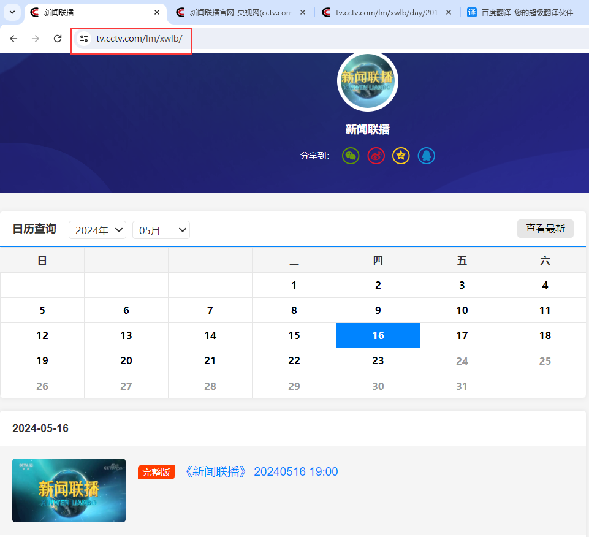
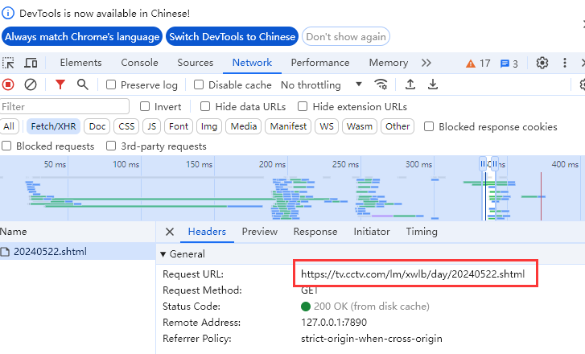

# 新闻联播数据集成文档
## 概述


- 为什么不采用OCR
  - 新闻联播没有字幕


## get_urls_txt.py

### 问题描述

关键问题：找到每个日期对应URL

新闻联播的官方地址为https://tv.cctv.com/lm/xwlb/

不同的日期选择会返回不同的数据，但是URL并没有改变。



进入开发者模式，查看`Request URL`，找到隐藏参数`day/$DATE`



但是这种方法只能适用于2016.2.5~至今，无法爬取2011-2015的数据，继续分析，发现2011-2015采用的是显示参数https://cctv.cntv.cn/lm/xinwenlianbo/20110509.shtml

### 解决方案

创建两个`base_url`进行匹配:

```python
base_url_2011_2015 = "https://cctv.cntv.cn/lm/xinwenlianbo/{date}.shtml"
base_url_2016_2024 = "https://tv.cctv.com/lm/xwlb/day/{date}.shtml"
```

### 代码

[[su-co/xwlb_crawling (github.com)](https://github.com/su-co/xwlb_crawling)](https://github.com/su-co/xwlb_crawling)

### 结果
[https://github.com/su-co/xwlb_crawling/blob/main/xwlb_urls.txt](https://github.com/su-co/xwlb_crawling/blob/master/xwlb_urls.txt)


## urls_redirect.py

### 重定向URL

包括更换 URL 前缀、去除分隔符等

### 结果

[xwlb_crawling/xwlb_redir_urls.txt at master · su-co/xwlb_crawling (github.com)](https://github.com/su-co/xwlb_crawling/blob/master/xwlb_redir_urls.txt)


## download.py

### 问题描述

新闻联播视频采取M3U8的视频格式，是一种基于HTTP Live Streaming（HLS）协议的视频文件格式。与传统的视频格式不同，M3U8视频格式将整个视频**分成多个小片段进行传输**，每个分片的URL均不同。

我们需要找到真实的m3u8的地址，并根据m3u8找到真实的分片地址。

### 解决方案

- 利用 browsermob 代理监听chrome和服务器之间的交互，抓取真实的m3u8地址
- 根据m3u8地址构建真实的分片地址
- 下载每个ts分片，并最终合并成一个完整的视频

参考文献：[Python爬取CCTV视频-CSDN博客](https://blog.csdn.net/Uncle_wangcode/article/details/127677768)

### 代码

[xwlb_crawling/download.py at master · su-co/xwlb_crawling (github.com)](https://github.com/su-co/xwlb_crawling/blob/master/download.py)
