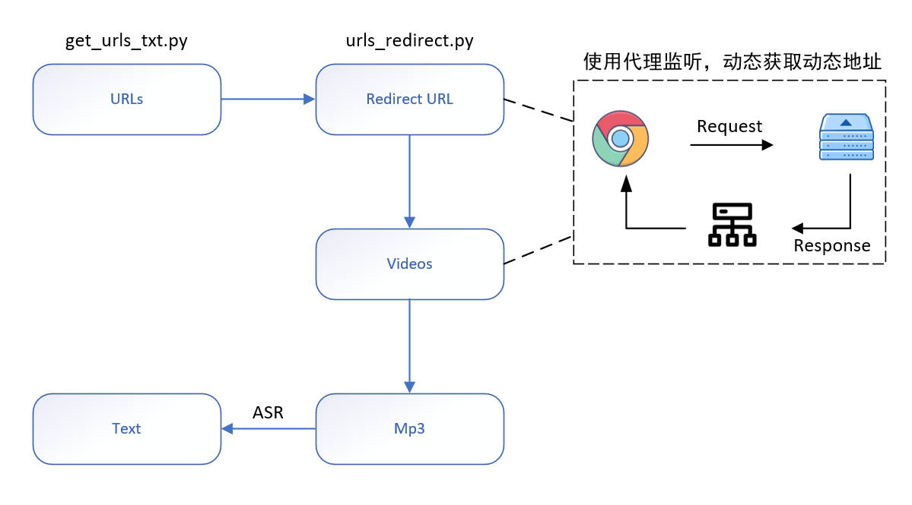

# 新闻联播数据集成文档
## 概述



- 为什么不采用OCR
  - 新闻联播没有字幕


## get_urls_txt.py

### 问题描述

关键问题：找到每个日期对应URL

新闻联播的官方地址为https://tv.cctv.com/lm/xwlb/

不同的日期选择会返回不同的数据，但是URL并没有改变。


进入开发者模式，查看`Request URL`，找到隐藏参数`day/$DATE`


但是这种方法只能适用于2016.2.5~至今，无法爬取2011-2015的数据，继续分析，发现2011-2015采用的是显示参数https://cctv.cntv.cn/lm/xinwenlianbo/20110509.shtml

### 解决方案

创建两个`base_url`进行匹配:

```python
base_url_2011_2015 = "https://cctv.cntv.cn/lm/xinwenlianbo/{date}.shtml"
base_url_2016_2024 = "https://tv.cctv.com/lm/xwlb/day/{date}.shtml"
```

### 代码

[su-co/xwlb_crawling (github.com)](https://github.com/su-co/xwlb_crawling)

### 结果
https://github.com/su-co/xwlb_crawling/blob/main/xwlb_urls.txt
